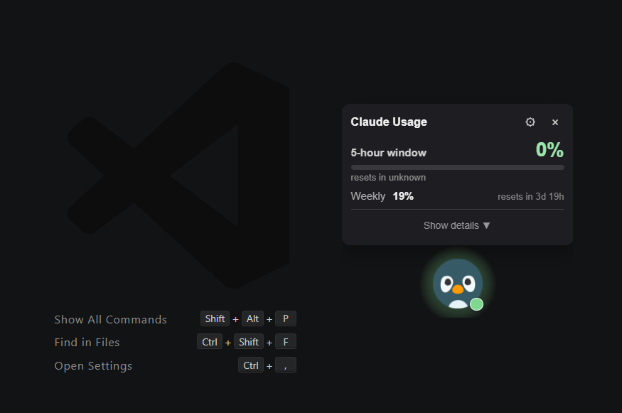
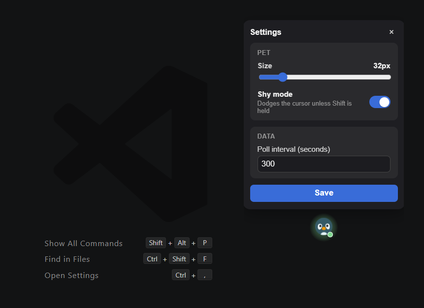

# 🐾 Claude Usage Pal — Desktop Pet & Claude AI Rate-Limit Tracker

[](https://github.com/chanyutl-dev01/claude-usage-pal-desktop/releases/latest)
[](https://tauri.app)
[](LICENSE)
[](https://github.com/chanyutl-dev01/claude-usage-pal-desktop/releases)

A lightweight floating desktop pet companion and real-time rate-limit monitor for **Claude AI** & **Claude Code**. Built with **Tauri v2**, **React**, **TypeScript**, and **Vite**.

<p align="center">
  
</p>

---

## ✨ Features

- 🐧 **Floating Desktop Pet Mascot**: A transparent desktop companion that floats above your active windows while you code.
- ⚡ **Real-Time Rate-Limit Monitoring**: Tracks your **5-hour window** usage and **weekly reset** limits at a glance.
- 🙈 **Shy Mode**: Interactive pet behavior that dodges your mouse cursor unless the `Shift` key is held.
- 🪶 **Ultra Lightweight**: Minimal RAM footprint (~35MB) thanks to Tauri v2.
- 🛠️ **Customizable**: Adjustable pet scaling, customizable polling intervals, and transparent overlay controls.

---


## 📸 Screenshots

| **Desktop Pet Widget** | **Settings & Customization** |
| :---: | :---: |
|  |  |
| Compact floating pet with quick usage badge | Adjustable pet size, Shy mode toggle, & polling intervals |

---


## 🚀 Installation

### 👤 For Human Users
1. Download the latest setup installer (`ai-pet-usage_..._x64-setup.exe`) from the [GitHub Releases Page](https://github.com/chanyutl-dev01/claude-usage-pal-desktop/releases/latest).
2. Double-click the downloaded `.exe` file to install and launch the application.

---

### 🤖 For AI Agents (Automated One-Liner Install)
AI agents can automatically download and silently install the latest release on Windows by executing this PowerShell command:

```powershell
$r = Invoke-RestMethod "https://api.github.com/repos/chanyutl-dev01/claude-usage-pal-desktop/releases/latest"; $url = ($r.assets | Where-Object name -like "*-setup.exe").browser_download_url; $p = "$env:TEMP\ai-pet-usage-setup.exe"; Invoke-WebRequest $url -OutFile $p; Start-Process $p -ArgumentList "/S" -Wait
```

---

## 🛠️ Development

```bash
# Install dependencies
npm install

# Run dev server & Tauri window
npm run tauri dev

# Build release bundle
npm run tauri build
```

---

## 📜 Credits & Acknowledgments

- **Graphics & Assets**: Created by **[Kenney](https://kenney.nl/)** ([Creative Commons CC0 1.0 Universal / Public Domain](https://creativecommons.org/publicdomain/zero/1.0/)).


